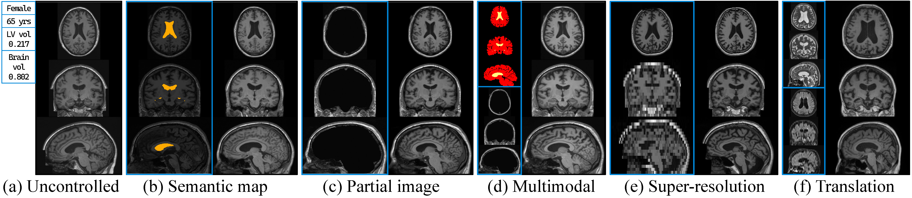

# Volumetric Conditioning Module to Control Pretrained Diffusion Models for 3D Medical Images
For reproducibility of Volumetric Conditioning Module (VCM) @ WACV 2025
[[paper](https://arxiv.org/pdf/2410.21826)][[arXiv](https://arxiv.org/abs/2410.21826)]





## 1. installation

### a. environment setup
```
conda create -n vcm python=3.12 -y
conda activate vcm
sh setup.sh
```

### b. accelerate setup

run `accelerate config` command in your shell for the accelerate configuration

_The following is an example_

```
----------------------------------------------------------------------------------------------------------------------------------
In which compute environment are you running?
This machine                                                                                                                                                                                                            
----------------------------------------------------------------------------------------------------------------------------------
Which type of machine are you using?                                                                                                                                                                                          
multi-GPU                                                                                                                                                                                                               
How many different machines will you use (use more than 1 for multi-node training)? [1]: 1                                                                                                                              
Should distributed operations be checked while running for errors? This can avoid timeout issues but will be slower. [yes/NO]: yes                                                                                      
Do you wish to optimize your script with torch dynamo?[yes/NO]:NO                                                                                                                                                       
Do you want to use DeepSpeed? [yes/NO]: NO                                                                                                                                                                              
Do you want to use FullyShardedDataParallel? [yes/NO]: NO                                                                                                                                                               
Do you want to use Megatron-LM ? [yes/NO]: NO                                                                                                                                                                           
How many GPU(s) should be used for distributed training? [1]:4                                                                                                                                                          
What GPU(s) (by id) should be used for training on this machine as a comma-seperated list? [all]:'0,1,2,3'                                                                                                              
Would you like to enable numa efficiency? (Currently only supported on NVIDIA hardware). [yes/NO]: NO
-----------------------------------------------------------------------------------------------------------------------------------
Do you wish to use FP16 or BF16 (mixed precision)?
bf16                                                                                                                                                                                                                    
accelerate configuration saved at /root/.cache/huggingface/accelerate/default_config.yaml
```

## 2. download weights

By using `models/large_files.yml`, download the weights for BrainLDM (53M for `autoencoder.pth` and 2.1G for `diffusion_model.path`) and VCM (173M).

locate them in the `models` directory


## 3. train VCM

You can train your VCM by modifying `acceler-VCM-newSemantics.py` and `newSemantics_loader.py` with your own conditions.

run the train code command:

```
CUDA_VISIBLE_DEVICES='0,1,2,3' accelerate launch --num_processes 4 --multi_gpu --gpu_ids='all' --main_process_port 29500 acceler-VCM-newSemantics.py
```


## 4. train VCM

You can perform sampling through the condition located in the `data/I-demo` folder via `VCM_sampling.ipynb`. 

Also, you can load and perform sampling of the VCM learned in another condition by referring to the code.


# Citation
If you want to refer this work, please use the following information (bibtex).
```
@InProceedings{Ahn_2025_WACV,
    author    = {Ahn, Suhyun and Park, Wonjung and Cho, Jihoon and Park, Jinah},
    title     = {Volumetric Conditioning Module to Control Pretrained Diffusion Models for 3D Medical Images},
    booktitle = {Proceedings of the Winter Conference on Applications of Computer Vision (WACV)},
    month     = {February},
    year      = {2025},
    pages     = {85-95}
}
```
